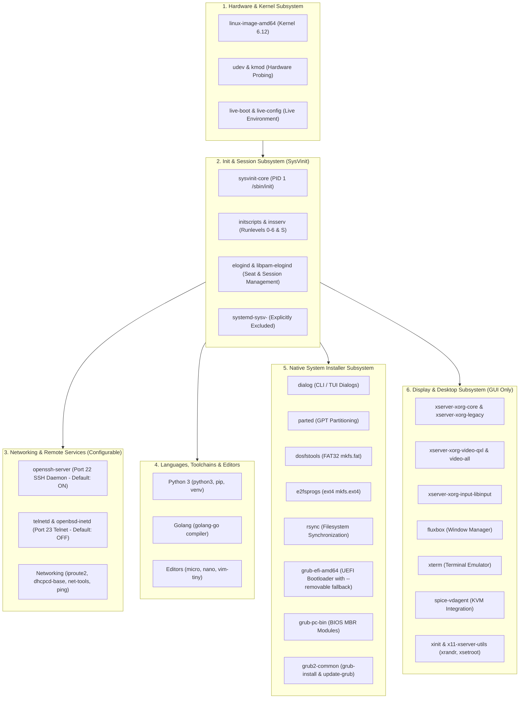
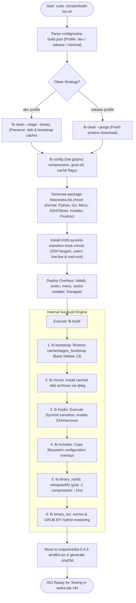
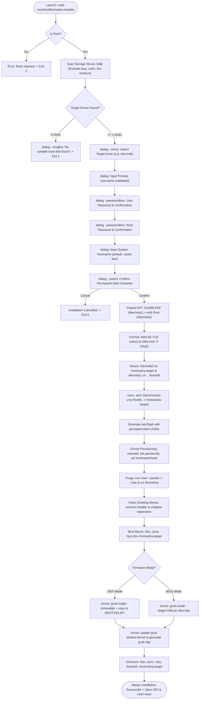
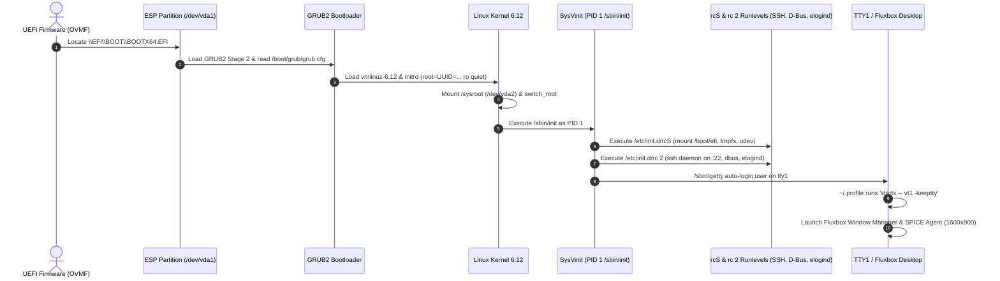

# Xedra Linux - System Dependency Hierarchy & Execution Flowcharts

This document provides visual architectural diagrams, dependency hierarchies, and end-to-end execution flowcharts for Xedra Linux 0.4.2.

---

## 1. Subsystem & Package Dependency Hierarchy

---

## 2. Live ISO Compilation Pipeline (`scripts/build-iso.sh`)

---

## 3. Native Disk Installer Execution Pipeline (`xedra-installer`)

---

## 4. Installed System Boot Lifecycle (First Boot from Hard Drive)

